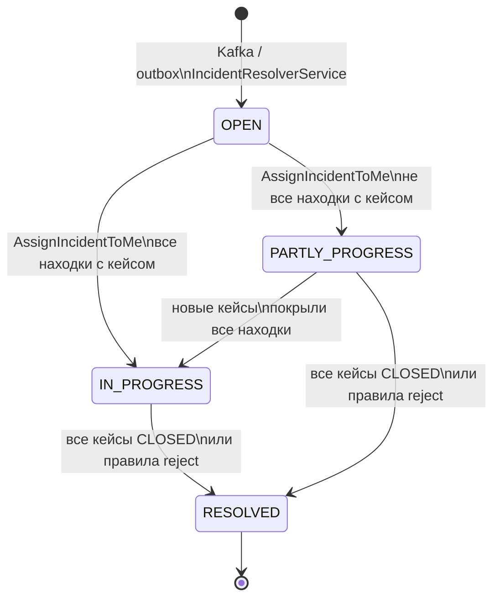
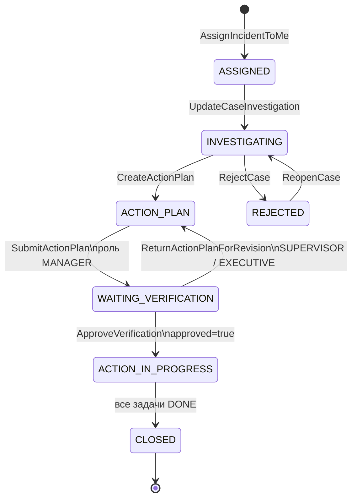

## Описание проекта

Микросервис `cms-workflow-service` предназначен для управления жизненным циклом инцидентов, расследований, кейсов и планов корректирующих действий в TrustFlow CMS. Сервис реализован на NestJS с разделением по принципам Clean Architecture и с предметной моделью в стиле DDD.

В корне кодовой структуры находится каталог `src`, который разделен на три основных слоя:

- `core` — бизнес-ядро;
- `infrastructure` — технические адаптеры и интеграции;
- `web` — REST API и модульная композиция приложения.

## Архитектура и модель слоев

### Модуль `core` — бизнес-ядро

Модуль `core` содержит бизнес-логику и не зависит от фреймворков хранения, транспорта и инфраструктуры.

#### `core/*/domain`

В доменном слое размещены сущности и агрегаты предметной области:

- `Incident` — инцидент комплаенс-риска со статусом, приоритетом, дедлайнами и связью с кейсом;
- `Case` (aggregate) — агрегат кейса, который управляет статусами и процессом обработки;
- `ActionPlan` — план корректирующих действий и набор задач исполнения;
- `Investigation` — сущность расследования для фиксации хода проверки;
- `OutboxMessage` — доменная модель сообщения outbox для надежной публикации событий.

#### `core/*/use-cases`

Пакеты use case реализуют прикладные сценарии и оркестрацию:

- инциденты: `IngestIncidentTopicUseCase`, `AssignIncidentToMeUseCase`, `GetIncidentListUseCase`, `GetIncidentReportUseCase`;
- кейсы: `GetCaseListUseCase`, `UpdateCaseInvestigationUseCase`, `RejectCaseUseCase`, `ReopenCaseUseCase`, операции с комментариями и вложениями;
- action plan: `CreateActionPlanUseCase`, `SubmitActionPlanUseCase`, `ApproveVerificationUseCase`, `ReturnActionPlanForRevisionUseCase`, сценарии по задачам и evidences;
- расследования: `GetInvestigationListUseCase`.

#### `core/*/ports`

Слой портов задает контракты, которые реализуются во внешних адаптерах:

- `IncidentRepository`, `CaseRepository`, `ActionPlanRepository`, `InvestigationRepository`;
- `OutboxRepository` для очереди доменных сообщений.

#### `core/*/services`

Доменные и прикладные сервисы, инкапсулирующие правила доступа и обработку:

- `IncidentResolverService` — обработка сообщений outbox по инцидентам;
- `CaseCollaborationAccessService` — правила коллаборации по кейсам;
- `ActionPlanTaskAccessService` — проверка доступа к задачам плана действий;
- `OutboxProcessorService` — фоновая обработка и ретраи outbox.

### Модуль `infrastructure` — реализация портов и интеграции

`infrastructure` реализует все зависимости от технологий:

- `persistence`-адаптеры (TypeORM ORM-entity + in-memory/postgres репозитории) для `incident`, `case`, `action-plan`, `investigation`, `outbox`;
- `database/migrations` — схема БД и эволюция структуры PostgreSQL;
- `incident-management/messaging/kafka-incident-topic.consumer.ts` — прием инцидентов из Kafka (топик из `KAFKA_INCIDENT_TOPIC`);
- `storage/minio-storage.service.ts` — работа с MinIO для вложений и evidences;
- `outbox`-адаптеры (`PostgresOutboxRepository`, `InMemoryOutboxRepository`) для надежной доставки событий.

Таким образом, технологическая реализация изолирована от бизнес-логики.

### Модуль `web` — API и композиция модулей

Слой `web` предоставляет REST-интерфейс и связывает use cases с HTTP-контрактами:

- `IncidentController` — чтение списков/статистики, отчеты, назначение инцидентов;
- `CaseController`, `CaseV1Controller` — управление кейсами, комментариями, вложениями, обновлением расследования;
- `ActionPlanController`, `TaskController`, `SupervisorVerificationController` — жизненный цикл action plan, задачи, верификация;
- `InvestigationController` — получение списка расследований.

DTO-слой (`dto`) и маппинг отделяют транспортные модели от доменных объектов.

## Реализация Clean Architecture

В проекте соблюдается разделение зависимостей:

- `domain` и `use-cases` находятся в `core` и не зависят от TypeORM, Kafka, MinIO;
- `infrastructure` зависит от `core`, реализуя порты и внешние интеграции;
- `web` зависит от `core` (use cases) и подключает инфраструктурные адаптеры через DI;
- outbox-паттерн обеспечивает надежность между транзакционной частью и асинхронной интеграцией.

## Реализация DDD

DDD в сервисе выражен через:

- агрегаты и сущности (`Case`, `Incident`, `ActionPlan`, `Investigation`);
- сценарии предметной области в use cases вместо логики в контроллерах;
- контракты репозиториев (ports), которые абстрагируют хранение;
- доменные сервисы для бизнес-правил и контроля доступа;
- outbox как механизм фиксации и публикации значимых изменений.

В результате бизнес-логика описана в терминах предметной области и изолирована от технических деталей.

## Подробная архитектурная схема

- [Architecture blueprint](./docs/architecture.md)

## Функциональные возможности по ролям

Перечень REST API и фоновых функций с указанием ролей **MANAGER**, **SUPERVISOR**, **EXECUTIVE**:

- **Документ Word:** [`docs/functional-capabilities.docx`](./docs/functional-capabilities.docx) — перечень функций по ролям и таблицы запросов/ответов для вариантов использования (просмотр кейса, план действий, расследование, исполнение плана, Dashboard/KPI)
- **Перегенерация:** `python docs/scripts/generate-functional-capabilities-docx.py`

Актуальный перечень эндпоинтов также в Swagger UI: `http://localhost:3000/api/docs`.

## Диаграмма концептуальной ER-модели

В проекте есть предметно-ориентированная ER-диаграмма в PlantUML:

- `diagrams/conceptual-er-model.puml`

Диаграмма показывает ключевые сущности домена (`Инцидент`, `Находка`, `Кейс`, `Расследование`, `План корректирующих действий`, `Задача`, `Верификация`) и связи между ними без углубления в технические детали хранения.  
Эту диаграмму удобно использовать для обсуждения бизнес-процессов и границ ответственности между этапами workflow.

## Логическая схема БД (нотация Чена, Draw.io)

Логическая ER-модель PostgreSQL-схемы сервиса в [нотации Чена](https://en.wikipedia.org/wiki/Entity%E2%80%93relationship_model#Chen_notation): сущности — прямоугольники, атрибуты (включая PK) — овалы, связи — ромбы. Имена таблиц указаны в скобках рядом с доменными названиями.

- **Файл:** [`diagrams/logical-schema-chen-drawio.drawio`](./diagrams/logical-schema-chen-drawio.drawio)
- **Как открыть:** [draw.io](https://app.diagrams.net/) / VS Code с расширением Draw.io — открыть файл из репозитория.
- **Текстовый источник:** [`diagrams/logical-schema-chen.puml`](./diagrams/logical-schema-chen.puml) (`@startchen`) — та же модель для рендера через PlantUML; draw.io-версия удобнее для правок визуально.

В отличие от концептуальной ER (`conceptual-er-model.puml`), здесь перечислены **колонки таблиц** и **кардинальности** связей, соответствующие миграциям TypeORM в `src/infrastructure/database/migrations`. Внешние ключи отражены ромбами связей и в списках атрибутов сущностей **не дублируются**.

### Сущности (таблицы)

| Группа | Сущность | Таблица |
|--------|----------|---------|
| Интеграция | Исходящее сообщение | `outbox_messages` |
| Инцидент | Инцидент | `incident` |
| | Обнаружения | `findings` |
| Кейс | Кейс | `cases` |
| | Расследование | `investigations` |
| | Комментарий к кейсу | `case_comments` |
| | Вложение к кейсу | `case_attachments` |
| План действий | План действий | `action_plans` |
| | Задача плана | `action_plan_tasks` |
| | Доказательство по задаче | `action_plan_task_evidences` |
| | Верификация плана | `verifications` |

`outbox_messages` на схеме **изолирована** (Transactional Outbox): внешних ключей на доменные таблицы нет.

### Описание сущностей

#### Исходящее сообщение (`outbox_messages`)

Запись очереди **Transactional Outbox** для надёжной асинхронной обработки. После приёма события из Kafka сервис сохраняет payload в `outbox_messages`; фоновый `OutboxProcessorService` обрабатывает сообщения (например, topic `incident_topic.received` → создание инцидента через `IncidentResolverService`). Поля `status`, `processed_at`, `error_message` отражают ход и результат обработки (`pending` / `processed` / `failed`).

#### Инцидент (`incident`)

Корневая сущность workflow: агрегат комплаенс-события по объекту риска компании. Создаётся после разбора входящего Kafka-сообщения; хранит контекст интеграции (`company_id`, `integration_id`, `risk_object_id`, `department_id`, `document_id`) и жизненный цикл на уровне инцидента (`OPEN`, `PARTLY_PROGRESS`, `IN_PROGRESS`, `RESOLVED`). При переходе в `RESOLVED` заполняется `resolved_date`. Один инцидент объединяет все находки и кейсы по одному срабатыванию мониторинга.

#### Обнаружения (`findings`)

Отдельное срабатывание правила внутри инцидента: приоритет, ссылка на правило (`rules_id`), ответственный (`assigned_user_id`), время обнаружения и дедлайн, произвольные детали в `details` (JSON). Одна находка может породить несколько кейсов (по разным исполнителям); у каждого кейса ровно одна находка-родитель.

#### Кейс (`cases`)

Единица работы исполнителя по конкретной находке в рамках инцидента. Статус отражает этап workflow (`ASSIGNED`, `INVESTIGATING`, `ACTION_PLAN`, `WAITING_VERIFICATION`, `ACTION_IN_PROGRESS`, `REJECTED`, `CLOSED` и др.). Уникальность по паре «инцидент + находка + исполнитель» (`uq_cases_incident_assignee`) не допускает дублирования кейса на одного ответственного. Через кейс доступны расследование, комментарии, вложения и план действий.

#### Расследование (`investigations`)

Материалы этапа расследования по кейсу: заметки (`investigation_notes`), установленная причина (`root_cause`), флаг необходимости корректирующих действий (`requires_corrective_action`). Связь с кейсом **1:1** — у кейса не более одного расследования. Временные метки `created_at` / `updated_at` фиксируют изменения записи.

#### Комментарий к кейсу (`case_comments`)

Текстовое сообщение участника в ленте обсуждения кейса: автор (`user_id`), текст (`comment`), момент публикации (`time`). Используется для коллаборации и истории решений без изменения статуса кейса.

#### Вложение к кейсу (`case_attachments`)

Метаданные файла, прикреплённого к кейсу: идентификатор в объектном хранилище MinIO (`file_id`), имя и размер, автор и время загрузки. Содержимое файла хранится вне PostgreSQL (S3/MinIO).

#### План действий (`action_plans`)

План корректирующих мер по кейсу: заголовок, описание, комментарий для согласования, флаг видимости задач (`show_tasks`). Привязан и к кейсу, и к инциденту (денормализация для выборок по инциденту). На один кейс — не более одного плана (`uq_action_plans_case_id`).

#### Задача плана (`action_plan_tasks`)

Конкретное действие в плане: название, описание, приоритет (`LOW` … `CRITICAL`), срок (`due_date`), статус (`TODO`, `IN_PROGRESS`, `DONE`), текстовые требования к доказательствам на этапах in progress / done, время завершения (`completed_at`).

#### Доказательство по задаче (`action_plan_task_evidences`)

Файл-доказательство выполнения задачи: ссылка на объект в MinIO (`file_id`), имя, автор и время прикрепления. Аналог вложений кейса, но в контексте исполнения и верификации задач плана.

#### Верификация плана (`verifications`)

Результат проверки плана супервайзером: флаг `verified`, назначенные проверяющие (`assigned_user_for_verification`, `assigned_employee_for_verification`), комментарии. На один план — не более одной записи верификации (`uq_verifications_action_plan_id`); после отправки плана кейс переходит в `WAITING_VERIFICATION`.

### Связи и кардинальности

| Связь | Сторона A | Сторона B |
|-------|-----------|-----------|
| содержит обнаружения | инцидент **1** | находки **N** |
| порождает кейсы | инцидент **1** | кейсы **N** |
| раскрывается в кейсах | находка **1** | кейсы **N** |
| расследуется | кейс **(0,1)** | расследование **1** |
| комментарии | кейс **1** | комментарии **N** |
| имеет вложения | кейс **1** | вложения **N** |
| имеет план | кейс **(0,1)** | план **1** |
| относится к инциденту | инцидент **1** | планы **N** |
| состоит из задач | план **1** | задачи **N** |
| верификация | план **(0,1)** | верификация **1** |
| подкрепляется доказательствами | задача **1** | доказательства **N** |

На draw.io-диаграмме цветом выделены области: синий — инцидент/кейс/расследование, зелёный — коллаборация по кейсу, жёлтый — план и задачи, оранжевый — верификация, серый — outbox.

## Физическая схема PostgreSQL

Итоговый DDL для развёртывания схемы «с нуля» (вне TypeORM):

- **Скрипт:** [`database/schema/create-physical-schema.sql`](./database/schema/create-physical-schema.sql)
- **Документ Word:** [`docs/physical-schema-postgresql.docx`](./docs/physical-schema-postgresql.docx) — описание сущностей и атрибутов в таблицах (перегенерация: `python docs/scripts/generate-physical-schema-docx.py`)
- **Описания в БД:** после создания таблиц выполняются `COMMENT ON TABLE` / `COMMENT ON COLUMN` — их видно в `psql` (`\d+ table`) и в каталоге PostgreSQL.

Имена колонок совпадают с TypeORM (в основном camelCase; исключение — `incident.resolved_date`).

### `outbox_messages`

| Атрибут | Тип | NULL | Описание |
|---------|-----|------|----------|
| `id` | uuid | NO | PK. UUID сообщения |
| `topic` | varchar(255) | NO | Логический тип события для обработчика (напр. `incident_topic.received`) |
| `payload` | jsonb | NO | JSON-тело события |
| `createdAt` | timestamptz | NO | Время постановки в outbox |
| `status` | varchar(20) | NO | `pending` \| `processed` \| `failed` |
| `processedAt` | timestamptz | YES | Время завершения обработки |
| `errorMessage` | text | YES | Текст ошибки при `failed` |

Индекс: `(status, createdAt)`.

### `incident`

| Атрибут | Тип | NULL | Описание |
|---------|-----|------|----------|
| `id` | uuid | NO | PK. UUID инцидента |
| `companyId` | varchar(255) | NO | Идентификатор компании (tenant) |
| `integrationId` | integer | NO | ID интеграции мониторинга |
| `riskObjectId` | varchar(255) | NO | ID объекта риска (monitoring) |
| `departmentId` | varchar(255) | YES | ID подразделения (обогащение из monitoring) |
| `documentId` | varchar(255) | YES | ID связанного документа из события |
| `status` | varchar(20) | NO | `OPEN`, `PARTLY_PROGRESS`, `IN_PROGRESS`, `RESOLVED` |
| `resolved_date` | timestamp | YES | Момент перехода в `RESOLVED` |

### `findings`

| Атрибут | Тип | NULL | Описание |
|---------|-----|------|----------|
| `id` | uuid | NO | PK. UUID находки |
| `priority` | varchar(50) | NO | Приоритет срабатывания правила |
| `assignedUserId` | varchar(255) | YES | Предлагаемый ответственный |
| `rulesId` | uuid | YES | UUID правила (risk-сервис) |
| `detectedAt` | timestamptz | YES | Время обнаружения |
| `deadline` | timestamptz | YES | Крайний срок обработки |
| `details` | jsonb | NO | Детали срабатывания (`result`, `found`, `details`, …) |
| `incidentId` | uuid | NO | FK → `incident.id` |

### `cases`

| Атрибут | Тип | NULL | Описание |
|---------|-----|------|----------|
| `id` | uuid | NO | PK. UUID кейса |
| `incidentId` | uuid | NO | FK → `incident.id` |
| `findingId` | uuid | NO | FK → `findings.id` |
| `assignedUserId` | varchar(255) | YES | Исполнитель; входит в `uq_cases_incident_assignee` |
| `status` | varchar(20) | NO | Этап workflow кейса (default `OPEN`) |

Уникальность: `(incidentId, findingId, assignedUserId)`.

### `investigations`

| Атрибут | Тип | NULL | Описание |
|---------|-----|------|----------|
| `id` | uuid | NO | PK. UUID расследования |
| `caseId` | uuid | NO | FK → `cases.id` (уникально) |
| `investigationNotes` | text | NO | Заметки по расследованию |
| `rootCause` | text | NO | Установленная первопричина |
| `requiresCorrectiveAction` | boolean | NO | Нужен ли план корректирующих действий |
| `createdAt` | timestamptz | NO | Время создания |
| `updatedAt` | timestamptz | NO | Время последнего изменения |

### `case_comments`

| Атрибут | Тип | NULL | Описание |
|---------|-----|------|----------|
| `id` | uuid | NO | PK. UUID комментария |
| `caseId` | uuid | NO | FK → `cases.id` |
| `userId` | varchar(255) | NO | Автор (CMS Auth) |
| `comment` | text | NO | Текст комментария |
| `time` | timestamptz | NO | Время публикации |

### `case_attachments`

| Атрибут | Тип | NULL | Описание |
|---------|-----|------|----------|
| `id` | uuid | NO | PK. UUID записи |
| `caseId` | uuid | NO | FK → `cases.id` |
| `userId` | varchar(255) | NO | Кто загрузил файл |
| `fileId` | varchar(255) | NO | Ключ объекта в MinIO |
| `time` | timestamptz | NO | Время загрузки |
| `name` | varchar(512) | NO | Имя файла |
| `size` | integer | NO | Размер в байтах (default 0) |

### `action_plans`

| Атрибут | Тип | NULL | Описание |
|---------|-----|------|----------|
| `id` | uuid | NO | PK. UUID плана |
| `caseId` | uuid | NO | FK → `cases.id` (уникально) |
| `incidentId` | uuid | NO | FK → `incident.id` |
| `title` | varchar(500) | YES | Заголовок |
| `description` | text | YES | Описание мер |
| `comment` | text | YES | Комментарий при согласовании |
| `showTasks` | boolean | NO | Видимость задач (default false) |

### `action_plan_tasks`

| Атрибут | Тип | NULL | Описание |
|---------|-----|------|----------|
| `id` | uuid | NO | PK. UUID задачи |
| `actionPlanId` | uuid | NO | FK → `action_plans.id` |
| `title` | varchar(255) | NO | Название |
| `description` | text | NO | Описание задачи |
| `priority` | varchar(20) | NO | `LOW`, `NORMAL`, `HIGH`, `CRITICAL` |
| `dueDate` | timestamptz | NO | Срок исполнения |
| `status` | varchar(20) | NO | `TODO`, `IN_PROGRESS`, `DONE` (CHECK) |
| `evidenceDescriptionInprogress` | text | YES | Требования к доказательствам (in progress) |
| `evidenceDescriptionDone` | text | YES | Требования к доказательствам (done) |
| `completedAt` | timestamptz | YES | Время завершения |

### `action_plan_task_evidences`

| Атрибут | Тип | NULL | Описание |
|---------|-----|------|----------|
| `id` | uuid | NO | PK. UUID записи |
| `taskId` | uuid | NO | FK → `action_plan_tasks.id` |
| `userId` | varchar(255) | NO | Кто прикрепил файл |
| `fileId` | uuid | NO | UUID объекта в MinIO |
| `name` | varchar(500) | NO | Имя файла |
| `time` | timestamptz | NO | Время прикрепления |

### `verifications`

| Атрибут | Тип | NULL | Описание |
|---------|-----|------|----------|
| `id` | uuid | NO | PK. UUID верификации |
| `actionPlanId` | uuid | NO | FK → `action_plans.id` (уникально) |
| `verified` | boolean | NO | План принят (default false) |
| `assignedUserForVerification` | varchar(255) | NO | ID верификатора (Auth) |
| `assignedEmployeeForVerification` | varchar(255) | NO | ID сотрудника (company-info) |
| `comments` | text | YES | Комментарий супервайзера |

## Взаимодействие с другими сервисами

Ниже — как `cms-workflow-service` связан с остальной платформой и инфраструктурой по текущей реализации в коде.

### Входящие интерфейсы

- **HTTP REST.** Сервис поднимает стандартное NestJS HTTP-приложение. Его используют клиенты CMS (frontend) и вышестоящие шлюзы. OpenAPI доступен по пути `api/docs`; порт задаётся переменной `PORT`.
- **Kafka (consumer only).** Параллельно подключается транспорт NestJS к брокерам Kafka и обрабатывает сообщения топика из `KAFKA_INCIDENT_TOPIC` (см. раздел ниже «Kafka: публикация сервисом и формат данных»). Идентификатор consumer group для Kafka задан в коде приложения значением `cms-workflow-service-consumer-group` (`src/web/main.ts`).

### Исходящие вызовы к другим микросервисам (HTTP)

Все ниже перечисленные обращения выполняются из use cases / сервисов ядра через `fetch`; часть запросов проксирует заголовок `Authorization` с входящего REST-запроса пользователя.

| Назначение | Переменная окружения | Типичное использование в сервисе |
|-------------|---------------------|----------------------------------|
| **Auth** | `CMS_AUTH_SERVICE_URL` | `GET /api/users/me` — текущий пользователь и контекст компании; `GET /api/internal/users/:userId` — обогащение ответов (ФИО, роли и т.п.). Используется в проверках доступа к кейсам, задачам плана действий, при работе со списками и отчётами по инцидентам. |
| **Monitoring** | `CMS_MONITORING_SERVICE_URL` | `GET /api/internal/risk-objects/:riskObjectId` с заголовком `CompanyId` — данные объектов риска (название, `departmentId` и др.) для отображения, отчётов и создания записи инцидента после обработки outbox (`IncidentResolverService`). |
| **Risk** | `CMS_RISK_SERVICE_URL` | Если не задана, используется `http://localhost:9094`. `GET /api/internal/rules/:ruleId` — метаданные правил; `GET /api/internal/risk-categories` — категории рисков для агрегированной статистики/отображения. |
| **Company Info** | `CMS_COMPANY_INFO_SERVICE_URL` | Если не задана, используется `http://localhost:9092`. `GET /employee/department-manager-subordinates` и `GET /employee/department-manager` (query: `userId`, `employeeId`, `companyId`) с заголовком `Authorization` — оргструктура для сценариев супервайзера, списков инцидентов и отправки плана действий. |

Отдельно: **во внешние топики Kafka сервис сейчас не публикует** (только потребляет входящие события и пишет внутреннюю таблицу outbox).

### Инфраструктурные зависимости

- **PostgreSQL** — основное хранилище доменных сущностей и `outbox_messages` (TypeORM).
- **MinIO (S3)** — объектное хранилище для вложений и evidence задач (`MINIO_*`).

## Жизненный цикл статусов инцидента и кейса

Статус **инцидента** — агрегированное состояние по всем находкам и кейсам одного события мониторинга. Статус **кейса** — этап работы конкретного исполнителя по одной находке. Переходы кейса инициируются REST-сценариями; статус инцидента пересчитывается в тех же use cases по правилам ниже (отдельного фонового «синхронизатора» нет).

При переходе инцидента в `RESOLVED` заполняется `incident.resolved_date`.

### Статусы инцидента

| Статус | Смысл |
|--------|--------|
| `OPEN` | Инцидент создан из Kafka/outbox, кейсов ещё нет или никто не взял работу в обработку. |
| `PARTLY_PROGRESS` | По инциденту есть кейсы, но не по всем находкам заведены кейсы (часть находок ещё без исполнителя/кейса). |
| `IN_PROGRESS` | Все находки «покрыты» кейсами; активная работа идёт по одному или нескольким кейсам (не все кейсы в терминальных состояниях). |
| `RESOLVED` | Обработка инцидента завершена на уровне агрегата (все кейсы закрыты успешно или согласно правилам отклонения). |

**Создание (`OPEN`).** `IncidentResolverService` после сообщения outbox создаёт инцидент со статусом `OPEN` и находки (`findings`) без кейсов.

**Назначение (`PARTLY_PROGRESS` / `IN_PROGRESS`).** `AssignIncidentToMeUseCase`: менеджер забирает находки (свои или без `assignedUserId`), для каждой создаётся кейс в статусе `ASSIGNED` (если кейса ещё не было). Затем:

- если для **каждой** находки выполняется «есть кейс **или** у находки нет `assignedUserId`» → `IN_PROGRESS`;
- иначе → `PARTLY_PROGRESS` (есть находка с ответственным, но без кейса).

**Завершение (`RESOLVED`).** Инцидент переводится в `RESOLVED` с `resolved_date`, когда:

1. **Все кейсы в `CLOSED`** — после `CompleteTaskUseCase` / `UpdateTaskUseCase`, когда у кейса все задачи плана в `DONE` (см. ниже цепочку кейса).
2. **Отклонение кейса** (`RejectCaseUseCase`) — если это единственный кейс инцидента; либо среди остальных нет активных в `ASSIGNED`/`INVESTIGATING` (детали в таблице пересчёта при `REJECTED`).

Прямого API «закрыть инцидент» нет: статус инцидента всегда выводится из состояния кейсов.

#### Пересчёт статуса инцидента при отклонении кейса

Допустимо только из `INVESTIGATING`, без существующего плана действий. Кейс → `REJECTED`, создаётся запись `action_plans` с комментарием отклонения.

| Условие по остальным кейсам того же инцидента | Статус инцидента |
|-----------------------------------------------|------------------|
| Это был единственный кейс | `RESOLVED` + `resolved_date` |
| Есть хотя бы один не-`REJECTED` в `ASSIGNED` | `PARTLY_PROGRESS` |
| Все не-`REJECTED` только в `INVESTIGATING` | `IN_PROGRESS` |
| Иначе (нет активных «ранних» стадий) | `RESOLVED` + `resolved_date` |



### Статусы кейса

| Статус | Смысл | Типичный триггер |
|--------|--------|------------------|
| `ASSIGNED` | Кейс создан, исполнитель назначен, расследование ещё не велось. | `AssignIncidentToMeUseCase` |
| `OPEN` | Значение по умолчанию в БД; **новые кейсы в коде получают `ASSIGNED`**. Встречается в отчётах/статистике для старых или неинициализированных записей. | Миграция / default |
| `INVESTIGATING` | Ведётся расследование (есть или обновляется `investigations`). | `UpdateCaseInvestigationUseCase` |
| `ACTION_PLAN` | Составляется или дорабатывается план корректирующих действий. | `CreateActionPlanUseCase`, `ReturnActionPlanForRevisionUseCase` |
| `WAITING_VERIFICATION` | План отправлен на проверку супервайзеру. | `SubmitActionPlanUseCase` |
| `ACTION_IN_PROGRESS` | План принят; исполняются задачи, можно прикреплять evidences. | `ApproveVerificationUseCase` |
| `REJECTED` | Кейс отклонён на этапе расследования (с комментарием в плане-дубликате). | `RejectCaseUseCase` |
| `CLOSED` | Все задачи плана по кейсу выполнены (`DONE`). | `CompleteTaskUseCase`, `UpdateTaskUseCase` |

Статус `IN_PROGRESS` в типе `CaseStatus` и в аналитике **для кейса в переходах не выставляется** — рабочий прогресс на этапе исполнения обозначается `ACTION_IN_PROGRESS`. Для инцидента `IN_PROGRESS` — отдельное агрегированное значение (см. выше).

#### Основной поток кейса (happy path)



#### Переходы и ограничения (кейс)

| Из | В | Use case / условие |
|----|---|---------------------|
| — | `ASSIGNED` | Создание кейса при назначении инцидента себе |
| `ASSIGNED` / др. | `INVESTIGATING` | Сохранение материалов расследования (без жёсткой проверки «только из ASSIGNED») |
| `INVESTIGATING` | `REJECTED` | Отклонение с обязательным `comment`; плана ещё нет |
| `REJECTED` | `INVESTIGATING` | `ReopenCaseUseCase` (статус инцидента при этом **не пересчитывается**) |
| `*` (есть кейс) | `ACTION_PLAN` | Создание/обновление плана и задач |
| `ACTION_PLAN` | `WAITING_VERIFICATION` | Отправка плана; создаётся/обновляется `verifications`, назначается руководитель подразделения |
| `WAITING_VERIFICATION` | `ACTION_PLAN` | Возврат на доработку с `comments` |
| `WAITING_VERIFICATION` | `ACTION_IN_PROGRESS` | Приёмка плана (`verified=true`, `showTasks=true`) |
| `ACTION_IN_PROGRESS` | `CLOSED` | Все `action_plan_tasks` кейса в статусе `DONE` |

Операции с вложениями кейса и evidences задач привязаны к статусу: вложения кейса — в основном `INVESTIGATING`; файлы-доказательства задач — только `ACTION_IN_PROGRESS`.

#### Завершение кейса и инцидента

Закрытие кейса **не отдельной кнопкой**, а следствием выполнения всех задач плана:

1. Задача → `DONE` (`CompleteTaskUseCase` или смена статуса в `UpdateTaskUseCase`).
2. Если **все** задачи плана кейса `DONE` → кейс → `CLOSED`.
3. Если **все** кейсы инцидента `CLOSED` → инцидент → `RESOLVED` + `resolved_date`.

Важно: при смеси `CLOSED` и `REJECTED` инцидент **не** перейдёт в `RESOLVED` автоматически (проверка требует именно `CLOSED` у каждого кейса). Для полностью отклонённых сценариев срабатывает логика `RejectCaseUseCase`.

### Связь «один инцидент — много кейсов»

- Одна **находка** может иметь несколько кейсов (разные `assignedUserId`); уникальность: `(incidentId, findingId, assignedUserId)`.
- Статус инцидента отражает **сводку** по всем кейсам, а не копирует статус одного кейса.
- KPI и отчёты (`get-operations-overview`, `get-my-incident-stats`) дополнительно используют «зависшие» инциденты: не `RESOLVED` и минимальный `findings.detectedAt` старше 14 суток.

### Статусы задач плана (`action_plan_tasks`)

Под-жизненный цикл внутри этапа `ACTION_IN_PROGRESS` (и подготовки в `ACTION_PLAN`):

| Статус | Смысл |
|--------|--------|
| `TODO` | Задача создана, не начата (default). |
| `IN_PROGRESS` | Исполнение; можно задать `evidenceDescriptionInprogress`. |
| `DONE` | Завершена; обязательно `evidenceDescriptionDone`, `completedAt`. |

Переходы: `UpdateTaskUseCase`, `CompleteTaskUseCase`. CHECK в БД: только эти три значения.

## Kafka: публикация сервисом и формат данных

### Топики Kafka, в которые пишет сервис

На текущий момент сервис **не публикует сообщения в Kafka**.

- Реализован только Kafka consumer (подписка на `KAFKA_INCIDENT_TOPIC`).
- В коде отсутствуют Kafka producer (`ClientKafka`, `emit`, `send`).
- После получения сообщения из Kafka сервис сохраняет его во внутренний outbox (таблица `outbox_messages`) для последующей обработки внутри сервиса.

### Что именно сервис сохраняет после Kafka-сообщения (внутренний outbox)

Сервис создает outbox-сообщение с topic `incident_topic.received` и payload в JSON-формате:

```json
{
  "companyId": "string",
  "integrationId": 123,
  "riskObjectId": "string",
  "documentId": "string (optional)",
  "rules": [
    {
      "rulesId": "string",
      "rulePriority": "string",
      "detectedAt": "ISO date string (optional)",
      "responsible_user_id": "string | null",
      "result": "string",
      "found": true,
      "details": {}
    }
  ],
  "receivedAt": "ISO date string"
}
```

### Формат входящего Kafka-сообщения (которое сервис читает)

Входящее сообщение из `KAFKA_INCIDENT_TOPIC` ожидается в JSON-формате:

```json
{
  "companyId": "string",
  "integrationId": 123,
  "riskObjectId": "string",
  "documentId": "string (optional)",
  "rules": [
    {
      "rulesId": "string",
      "rulePriority": "string",
      "detectedAt": "ISO date string (optional)",
      "responsible_user_id": "string | null",
      "result": "string",
      "found": true,
      "details": {}
    }
  ]
}
```

Обязательная валидация перед сохранением в outbox:

- `companyId` — обязателен;
- `riskObjectId` — обязателен;
- `rules` — обязателен и должен быть массивом.

Если в будущем будет добавлен Kafka producer, этот раздел нужно дополнить таблицей: `topic` / `назначение` / `schema`.

Environment variables:

- `PORT` — порт HTTP-сервера (обязательный для запуска, см. `src/web/main.ts`)
- `KAFKA_BROKERS` — список брокеров через запятую (обязательный)
- `KAFKA_CLIENT_ID` — идентификатор Kafka-клиента (обязательный)
- `KAFKA_INCIDENT_TOPIC` — имя Kafka-топика для приёма инцидентов (обязательный)
- `KAFKA_GROUP_ID` — в текущем коде **не читается**; consumer group зафиксирован в `main.ts`: `cms-workflow-service-consumer-group`
- `CMS_AUTH_SERVICE_URL` — базовый URL сервиса аутентификации/CMS Auth
- `CMS_MONITORING_SERVICE_URL` — базовый URL monitoring-сервиса (risk objects API)
- `CMS_RISK_SERVICE_URL` — базовый URL risk-сервиса (необязательный; дефолт в коде: `http://localhost:9094`)
- `CMS_COMPANY_INFO_SERVICE_URL` — базовый URL company-info (необязательный; дефолт в коде: `http://localhost:9092`)
- `DB_HOST` (default: `localhost`)
- `DB_PORT` (default: `5432`)
- `DB_USER` (default: `postgres`)
- `DB_PASSWORD` (default: `postgres`)
- `DB_NAME` (default: `cms_workflow`)
- `DB_SYNCHRONIZE` (default: `false`, set `true` only for local development)
- `OUTBOX_RESOLVER_INTERVAL_MINUTES` (default: `1`, set `10` to run every 10 minutes)
- `MINIO_ENDPOINT` (default: `localhost`)
- `MINIO_PORT` (default: `9000`)
- `MINIO_USE_SSL` (default: `false`)
- `MINIO_ACCESS_KEY` (default: `minioadmin`)
- `MINIO_SECRET_KEY` (default: `minioadmin`)
- `MINIO_BUCKET` (default: `cms-workflow-attachments`)

## Project setup

```bash
$ npm install
```

## Compile and run the project

```bash
# development
$ npm run start

# watch mode
$ npm run start:dev

# production mode
$ npm run start:prod
```

## API documentation

Swagger UI is available at:

- `http://localhost:3000/api/docs`

## MinIO for attachments

Run MinIO for this service locally:

```bash
docker compose -f docker-compose.minio.yml up -d
```

MinIO endpoints:

- S3 API: `http://localhost:9000`
- Console: `http://localhost:9001`

## Run tests

```bash
# unit tests
$ npm run test

# e2e tests
$ npm run test:e2e

# test coverage
$ npm run test:cov
```
